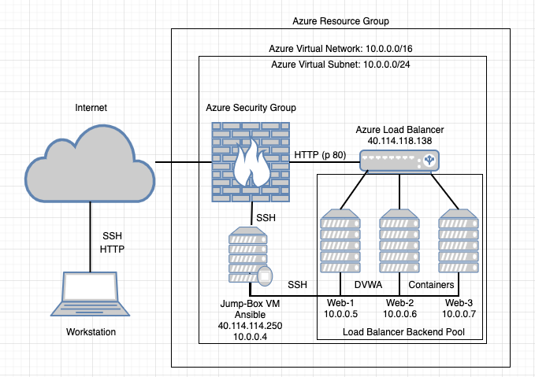

# Alpha_Security
Beginning repo from Cybersecurity Bootcamp
## Automated ELK Stack Deployment

The files in this repository were used to configure the network depicted below.

These files have been tested and used to generate a live ELK deployment on Azure. They can be used to either recreate the entire deployment pictured above. Alternatively, select portions of the Ansible/Full_install.yml.txt file may be used to install only certain pieces of it, such as Filebeat.

[Full Install Playbook](Ansible/Full_install.yml.txt)

This document contains the following details:
- Description of the Topologu
- Access Policies
- ELK Configuration
  - Beats in Use
  - Machines Being Monitored
- How to Use the Ansible Build

### Description of the Topology

The main purpose of this network is to expose a load-balanced and monitored instance of DVWA, the D*mn Vulnerable Web Application.

Load balancing ensures that the application will be highly stable, in addition to restricting access to the network.

Integrating an ELK server allows users to easily monitor the vulnerable VMs for changes to the log files and system metrics.

The configuration details of each machine may be found below.

| Name               | Function       | IP Address | Operating System |
|--------------------|----------------|------------|------------------|
| JumpBoxProvisioner | Gateway        | 10.0.0.4   | Linux            |
| Web-1              | DVWA Container | 10.0.0.5   | Linux            |
| Web-2              | DVWA Container | 10.0.0.6   | Linux            |
| Web-3              | DVWA Container | 10.0.0.7   | Linux            |
| ELK-Server         | ELK Server     | 10.1.0.4   | Linux            |

### Access Policies

The machines on the internal network are not exposed to the public Internet. 

Only the JumpBoxProvisioner machine can accept connections from the Internet. Access to this machine is only allowed from the following IP addresses:
- My personal machine

Machines within the network can only be accessed by Ansible on the JumpBoxProvisioner.
- JumpBoxProvisioner 13.64.48.207

A summary of the access policies in place can be found in the table below.

| Name               | Publicly Accessable | Allowed IP Addresses |
|--------------------|---------------------|----------------------|
| JumpBoxProvisioner | Yes                 | My Host Machine      |
| Web-1              | No                  | 13.64.48.207         |
| Web-2              | No                  | 13.64.48.207         |
| Web-3              | No                  | 13.64.48.207         |
| ELK-Server         | No                  | 13.64.48.207         |

### Elk Configuration

Ansible was used to automate configuration of the ELK machine. No configuration was performed manually, which is advantageous because...
- I was able to automate the setup and configuration, making it replicable across other networks and machines

The playbook implements the following tasks:
- Installs Docker.io
- Installs Python and the Docker Python Module
- Increases the ELK-server virtual memory and maintains it across reboots
- Downloads and Installs the Docker ELK container

The following screenshot displays the result of running `docker ps` after successfully configuring the ELK instance.

**Note**: The following image link needs to be updated. Replace `docker_ps_output.png` with the name of your screenshot image file.  

### Target Machines & Beats
This ELK server is configured to monitor the following machines:

| Name  | IP Address |
|-------|------------|
| Web-1 | 10.0.0.5   |
| Web-2 | 10.0.0.6   |
| Web-3 | 10.0.0.7   |

We have installed the following Beats on these machines:
- FileBeat
- MetricBeat

These Beats allow us to collect the following information from each machine:
- FileBeat tracks changes in system logs, including things such as login attempts and commands run as sudo
- MetricBeat tracks system metrics, such as CPU and memory usage.

### Using the Playbook
In order to use the playbook, you will need to have an Ansible control node already configured. Assuming you have such a control node provisioned: 

SSH into the control node and follow the steps below:
- Copy the install-elk.yml file to /etc/ansible#.
- Update the hosts file to create an ELK group and include the private IP address of your ELK server 
- Run the playbook, and navigate to Kibana at http://104.43.245.248:5601/app/kibana#/home to check that the installation worked as expected.
